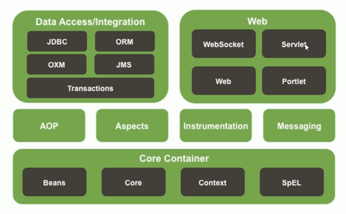
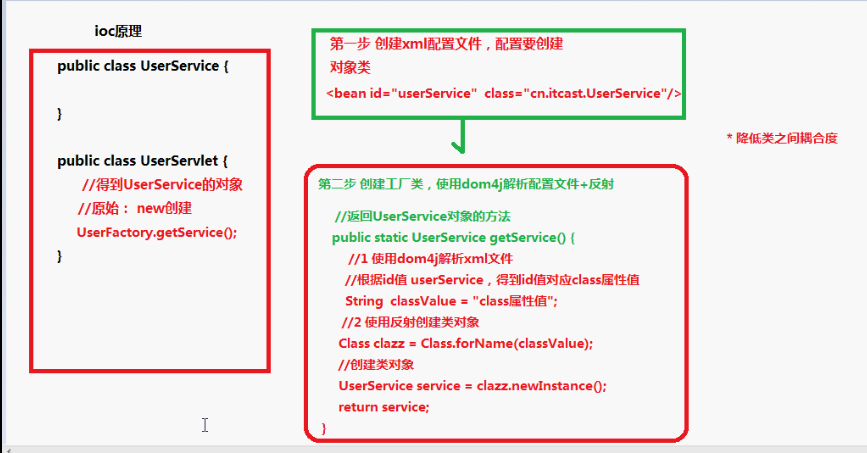
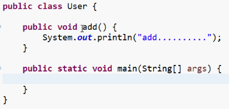

# Spring入门


## Spring概述


#### 什么是Spring

- Sping是一个开源框架
- Spring为简化企业级应用开发而生。使用Spring可以使简单的JavaBean实现以前只有EJB才能实现的功能
- Spring是JavaSE/EE的一站式框架


#### Spring的优点

- 方便解耦，简化开发
  
- Spring就是一个大工厂，可以将所有对象创建和依赖关系维护，交给Spring管理
  
- AOP编程的支持
  
- Spring提供面向切面编程，可以方便的实现队程序进行权限拦截、运行监控等功能
  
- 声明式事务的支持
  
- 只需要通过配置就可以完成对事务的管理，无需手动编程
  
- 方便程序的测试
  
- Spring对Junit4支持，可以通过注解方便的测试Spring程序
  
- 方便集成各种优秀框架
  
- Spring不排斥各种优秀的开源框架，其内部提供了各种优秀框架（如：Struts、Hibernate、Mybatis等）的直接支持
  
- 降低JavaEE API的使用难度
  
  - Spring对JavaEE开发中非常难用的一些API（JDBC、JavaMail、远程调用等），都提供了封装，使这些API应用难度大大降低
  
    


#### Spring的模块




## Spring IOC的底层原理实现

**IOC:inverse of Control反转控制**




## Spring IOC的快速入门案例

- 下载Spring最新开发包
- 导入Jar包
- 理解IOC控制反转和DI依赖注入
  - **IOC:inverse of Control反转控制**：将原本在程序中手动创建UserService对象的控制权，交由Spring框架管理
  - 简单说，就是创建UserService对象控制权被反转到了Spring框架
  - **DI：Dependency Injection依赖注入**：在Spring创建这个对象的过程中，将这个对象所依赖的属性注入进去
- 编写Spring核心配置文件
- 在程序中读取Spring配置文件，通过Spring框架获得Bean，完成相应操作


## Spring的IOC实现过程

- 导入Jar包
    - 如果做Spring最基本的功能，只需要导入最基本的四个即可。（Beans、Core、Context、SpEL）。

    - 因为Spring没有提供日志功能，所以除了上述jar包之外，还要有输出日志的jar包（commons-logging.jar和log4j.jar）。

      

- 创建类，在类中创建方法：创建一个简单的类。




- 创建Spring配置文件，配置创建类

    - Spring核心配置文件名称和位置不是固定的。 一般为Maven项目中resources下的ApplicationContext.xml。

    - 引入约束

      ```java
      <beans xmlns:xsi="http://www.w3.org/2001/XMLSchema-instance"
          xmlns="http://www.springframework.org/schema/beans" xmlns:context="http://www.springframework.org/schema/context"
          xmlns:aop="http://www.springframework.org/schema/aop" xmlns:tx="http://www.springframework.org/schema/tx"
          xsi:schemaLocation="http://www.springframework.org/schema/beans 
      http://www.springframework.org/schema/beans/spring-beans.xsd 
      http://www.springframework.org/schema/context 
      http://www.springframework.org/schema/context/spring-context.xsd 
      http://www.springframework.org/schema/aop 
      http://www.springframework.org/schema/aop/spring-aop.xsd 
      http://www.springframework.org/schema/tx 
      http://www.springframework.org/schema/tx/spring-tx.xsd">
      <beans>
      ```

  - 配置Bean

    ```java
        <bean id="user" class="com.yl.user">
        
        </bean>
    ```

    

- 写代码测试创建过程:

  ```java
  //    创建Spring的工厂
      ApplicationContext applicationContext = new ClassPathXmlApplicationContext("ApplicationContext.xml");
      //通过工厂获得类：
      User user=(User)applicationContext.getBean("user");
      user.sayHello();
      }
  
  ```

