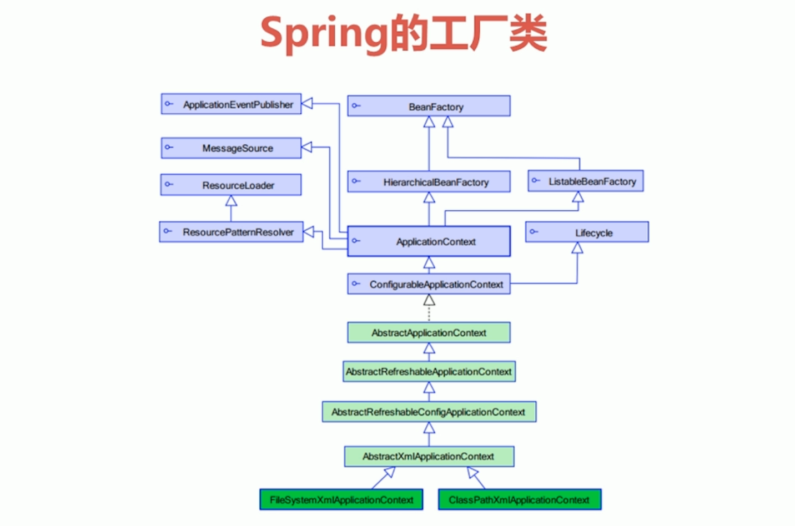

# Spring Bean管理


## Spring的工厂类介绍



**常用接口 :  ApplicationContext**

**实现类 :  **

- **ClassPathXmlApplicationContext**——类路径下，最常用

  ```java
  ApplicationContext applicationContext = new ClassPathXmlApplicationContext("applicationContext.xml")
  ```


- **FileSystemXmlApplicationContext**——读取磁盘系统中的配置文件

  ```java
  ApplicationContext applicationContext = new FileSystemXmlApplicationContext("c:\\applicationContext.xml")
  ```


- **XmlBeanFactory**——传统方式的工厂类

  - 类路径

  ```java
  BeanFactory beanFactory = new XmlBeanFactory(new ClassPathResource("applicationContext.xml"));
  ```

  - 读取磁盘系统

  ```java
  BeanFactory beanFactory = new XmlBeanFactory(new FileSystemResource("c:\\applicationContext.xml"));
  ```

  

  

  

  

## 三种实例化bean的方式

- ### 使用类构造器实例化（默认无参数）【常用】

  - ```xml
    //配置文件
    <bean id="bean1" class="com.imooc.ioc.demo2.Bean1"/>
    ```


- ### 使用静态工厂方式实例化（简单工厂模式）

  - ```java
    //静态工厂类
    public class Bean2Factory {
        public static Bean2 createBean2(){
            System.out.println("Bean2Factory的方法已经执行了...");
            return new Bean2();
        }
    }
    ```

  - ```xml
    //配置文件：
    //静态可以通过  类名.实例化bean方法(bean2Factory.creatBean2) 获取bean
    <bean id="bean2" class="com.imooc.ioc.demo2.Bean2Factory" factory-method="createBean2"/>
    ```

  

- ## 使用实例工厂方式实例化（工厂方式模式）

  - ```java
    //非静态工厂类
    public class Bean3Factory {
        public Bean3 createBean3(){
            System.out.println("Bean3Factory执行了...");
            return new Bean3();
        }
    }
    ```

  - ```xml
    //配置文件：
    //非静态要先实例化工厂，再调用实例化bean方法
    <bean id="bean3Factory" class="com.imooc.ioc.demo2.Bean3Factory"/>
    
    <bean id="bean3" factory-bean="bean3Factory" factory-method="createBean3"/>
    ```


## Bean的常用配置

- #### id和name

  - 一般情况下，装配一个Bean时，通过制定一个id属性作为Bean的名称
  - id属性再IOC容器中必须是**唯一**的
  - **如果Bean的名称中含有特殊字符，就需要使用name属性**

- #### class

  - class用于设置一个类的完全路径名称，主要作用是IOC容器生成类的实例


## Bean的作用域

通过	**scope**	属性配置。

例 : 

```xml
<bean id="person" class="com.imooc.ioc.demo3.Person" scope="prototype"/>
```


|     类别      | 说明                                                         |
| :-----------: | :----------------------------------------------------------- |
| **singleton** | 在spring IoC容器仅存在一个Bean实例，Bean以单例方式存在，**默认值** |
| **prototype** | 每次从容器中调用Bean时，都返回一个新的实例，**即每次调用getBean()时，相当于执行newXxxBean()** |
|  **request**  | 每次HTTP请求都会创建一个新的Bean，该作用域仅适用于WebApplicationContext环境 |
|  **session**  | 同一个HTTP Session共享一个Bean，不同Session使用不同的Bean，仅适用于WebApplicationContext环境 |


## Spring容器中Bean的生命周期

Spring初始化Bean或销毁Bean时，有时需要做一些处理工作，因此spring可以在创建和销毁bean的时候调用bean的两个生命周期方法

```xml
//当bean被载入到容器时调用init
//当bean从容器中删除时调用destory（scope=singleton才有效）
<bean id="xxx" class="..." init-method="init" destory-method="destory" />
```


### 完整生命周期步骤：

1. #### 第一步：初始化...

   instantiate bean对象实例化

2. ####  第二步：设置属性

   populate properties封装属性

3. ####  第三步：设置Bean的名称

    如果Bean实现BeanNameAware，执行**setBeanName**方法

4. ####  第四步：了解工厂信息

   如果Bean实现BeanFactoryAware或者ApplicationContextAware，执行设置工厂**setBeanFactory**方法或者执行上下文对象**setApplicationContext方法**

5. ####  第五步：初始化前方法...

   如果存在类实现**BeanPostProcessor（处理Bean）**，执行**postProcessBeforeInitialization**方法

6. ####  第六步：属性设置后

   如果Bean实现InitializingBean，执行**afterPropertiesSet方法**

7. ####  第七步：MAN被初始化了

   调用`<bean init-method="init">`指定初始化方法**init**

8. ####  第八步：初始化后方法

   如果存在类实现**BeanPostProcessor（处理Bean）**，执行**postProcessAfterInitialization**

9. #### 第九步：执行业务方法

   **执行业务处理**

10. ####  第十步：执行Spring的销毁方法

    如果Bean实现DisposableBean，执行**destroy**

11. ####  第十一步：MAN被销毁了

    调用`<bean destroy-method="customerDestroy">`指定的销毁方法customerDestroy


## Spring的属性注入方法

### [构造函数]属性注入

- 通过构造方法注入Bean的属性值或依赖的对象，它保证了Bean实例在实例化后就可以使用

- 在Spring配置文件中，构造器注入`<constructor-arg>`元素里声明的属性

- 例：

  ```xml
  <!--Bean的构造方法的属性注入-->
      <bean id="user" class="com.imooc.ioc.demo4.User">
          <constructor-arg name="name" value="张三" />
          <constructor-arg name="age" value="23"/>
      </bean>
  ```


### [set方法]属性注入(常用)

- 使用set方法注入，在Spring配置文件中，通过`<property>`设置注入的属性

- 通过`<property name="xxx" ref="xxx"/>`来注入对象类型属性

- 例：

  ```xml
  <bean id="person" class="com.imooc.ioc.demo4.Person">
          <property name="name" value="李四"/>
          <property name="age" value="32"/>
      	<!--对象类型属性-->
          <property name="cat" ref="cat"/>
  </bean>
  
  <!--对象类型属性中的属性-->
  <bean id="cat" class="com.imooc.ioc.demo4.Cat">
          <property name="name" value="ketty"/>
  </bean>
  ```


### [p名称空间]的属性注入

- 使用p命名空间

- 为了简化XML文件配置，Spring从2.5开始引入一个新的p名称空间

- `p:属性名="xxx"`引入常量值

- `p:属性名-ref="xxx"`引用其它Bean对象

- 例：

  ```xml
  <!--Bean的p名称空间的属性注入-->
  <bean id="person" class="com.imooc.ioc.demo4.Person" p:name="大黄" p:age="34" p:cat-ref="cat"/>
  
  <bean id="cat" class="com.imooc.ioc.demo4.Cat" p:name="小黄"/>
  ```


### [SpEL]的属性注入

- spEL:Spring Expression Language，spring表达式语言，对依赖注入进行简化

- 语法：`#{表达式}`

- ```xml
  <bean id="xxx" value="#{表达式}"
  ```

  - `#{'string'}` ：使用字符串
  - `#{beanId}` ：使用另一个Bean
  - `#{beanId.method()}` : 使用指定名属性，并使用方法
  - `#{T(java.lang.Math).PI}` : 使用静态字段或方法

- 例：

  ```xml
      <!--Bean的SpEL的属性注入-->
      <bean id="category" class="com.imooc.ioc.demo4.Category">
          <property name="name" value="#{'服装'}"/>
      </bean>
  
      <bean id="productInfo" class="com.imooc.ioc.demo4.ProductInfo"/>
  
      <bean id="product" class="com.imooc.ioc.demo4.Product">
          <property name="name" value="#{'男装'}"/>
          <property name="price" value="#{productInfo.calculatePrice()}"/>
          <property name="category" value="#{category}"/>
      </bean>
  ```


### [复杂类型]的属性注入

- 数组类型的属性注入

  ```xml
  <!--数组类型-->
  	private String[] arrs; // 数组类型
          <property name="arrs">
              <list>
                  <value>aaa</value>
                  <value>bbb</value>
                  <value>ccc</value>
              </list>
          </property>
  ```

  

- List集合类型的属性注入

  ```xml
  <!--List集合的属性注入-->
  	private List<String> list;// List集合类型
          <property name="list">
              <list>
                  <value>111</value>
                  <value>222</value>
                  <value>333</value>
              </list>
          </property>
  ```

  

- Set集合类型的属性注入

  ```xml
   <!--Set集合的属性注入-->
  	private Set<String> set; // Set集合类型
          <property name="set">
              <set>
                  <value>ddd</value>
                  <value>eee</value>
                  <value>fff</value>
              </set>
          </property>
  ```

  

- Map集合类型的属性注入

  ```xml
  <!--Map集合的属性注入-->
  	private Map<String,Integer> map;// Map集合类型
  		<property name="map">
      		<map>
          		<entry key="aaa" value="111"/>
          		<entry key="bbb" value="222"/>
          		<entry key="ccc" value="333"/>
      		</map>
  		</property>
  ```

  

- Properties类型的属性注入

  ```xml
  <!--Properties的属性注入-->
  	private Properties properties; // 属性类型        
  		<property name="properties">
              <props>
                  <prop key="username">root</prop>
                  <prop key="password">1234</prop>
              </props>
          </property>	
  ```


## SpringBean管理的注解方式(annotation)

### 在Spring配置文件中开启注解扫描

在applicationContext.xml中添加配置

```xml
<!--开启注解扫描-->
<context:component-scan base-package="扫描的包名"/>

上面的标签包含了<context:annotation-config/>，所以属性注入注解也开启了
```


### 使用注解[定义Bean]

- Spring2.5 引入使用注解去定义 Bean
  -  **@Component**  描述Spring框架中 Bean
- 除了 @Component 外，Spring提供了3个功能基本和 @Component 等效的注解，让标注类本身的用途清晰，Spring在后续版本会对其增强
  - **@Repository** 用于对 DAO 实现类进行标注
  - **@Service** 用于对 Service 实现类进行标注
  - **@Controller** 用于对Controller实现类进行标注


### 使用注解[属性注入]

- 使用 **@Value** 进行普通类型属性注入

```java
@Value("米饭")
private String something;
```


- 使用 **@Autowired** 进行自动注入
  -  **@Autowired默认按照类型进行注入**
    - **如果存在两个相同Bean类型相同，则按照名称注入** 
  -  **@Autowired注入时可以针对成员变量或者针对set方法**
  - 通过 @Autowired 的required属性，设置一定要找到匹配的Bean
  - **使用@Qualifier指定注入Bean的名称**
  - **使用@Qualifier指定Bean名称后，注解Bean必须指定相同名称**

  ```java
  //Service类：
  @Autowired //使用 @Autowired 进行自动注入
  @Qualifier("userDao") //使用@Qualifier指定注入Bean的名称
  private UserDao userDao;
  ```

  ```java
  //DAO类：
  @Repository("userDao")//使用@Qualifier指定Bean名称后，注解Bean必须指定相同名称
  public class UserDao {
      public void save() {
          System.out.println("DAO中保存用户");
      }
  }
  ```


- **@Resource**注入

  - Spring提供对 JSR-250 中定义**@Resource**标准注解的支持

  - @Resource和@Autowired注解功能相似

    ```java
    /*效果和
    *@Autowired
    *@Qualifier("userDao")
    *一样
    */
    @Resource(name = "userDao")
    private UserDao userDao;
    ```

    


### 使用注解[Bean作用范围]

- 使用注解配置的Bean和`<bean>`配置的一样，默认作用范围都是singleton

- **@Scope 注解用于指定Bean的作用范围**

  例：

  ```java
  @Component("bean2")
  @Scope("prototype")//指定Bean的作用范围
  public class Bean2 {}
  ```

  


### 其他注解

Spring初始化Bean或销毁Bean时，有时需要作一些处理工作，因此Spring可以在创建和拆卸Bean的时候调用Bean的两个声明周期方法

- 当Bean被载入到容器的时候**调用init**

  初始化方法的注解 ： **@PostConstruct**

  例：

  ```java
      @PostConstruct
      public void init() {
          System.out.println("bean1 init...");
      }
  ```

  

- 当Bean从容器中删除的时候**调用destroy(当scopre=singleton才有效)**

  销毁方法的注解 ：**@PreDestroy**

  例：

  ```java
      @PreDestroy
      public void destroy() {
          System.out.println("bean1 destroy..");
      }
  ```


### 传统XML配置和注解配置混合使用

- XML方式的优势
  - 结构清晰，易于阅读
- 注解方式的优势
  - 开发便捷，属性注入方便
- XML与注解的混合开发
  - 引入context命名空间
  - 在配置文件中田间`<context:annotation-config/>`标签来**单独**使用属性注入的注解，
  - `<context:component-scan base-package="扫描的包名"/>`中包括了`<context:annotation-config/>`