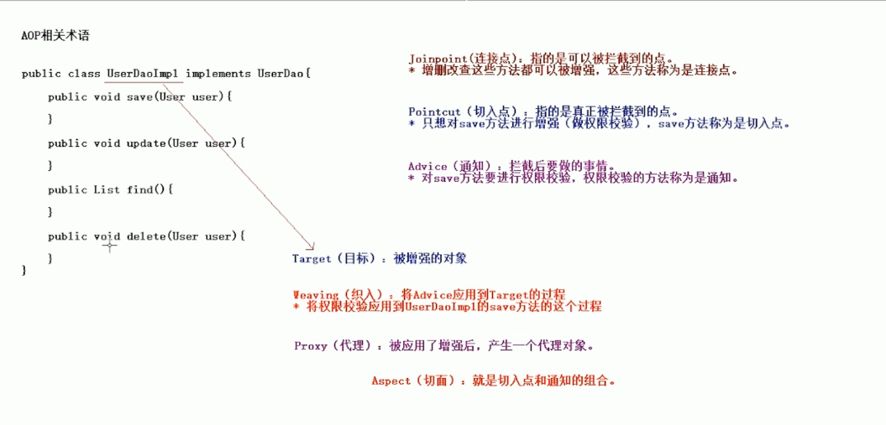

# Spring AOP


## AOP概述

### 	AOP概念

- **AOP: Aspect Oriented Programing 面向切面编程**
- AOP采取横向抽取机制，取代了传统纵向继承体系重复性带代码（性能监视、事务管理、安全检查、缓存）
- ,Spring AOP使用纯java实现，不需要专门的编译过程和类加载器，在运行期通过代理方式向目标类织入增强代码


### 	AOP相关术语

- **Jinpoint(连接点)：指的是可以被拦截到的点。**

  **所谓连接点是指那些被拦截到的点。在 spring 中,这些点指的是方法,因为 spring 只支持方法类型的连接点。**

  

- **Pointcut(切入点)：指的是真正被拦截到的点**

  所谓切入点是指我们要对哪些 Joinpoint 进行拦截的定义。

  

- **Advice(通知/增强)：拦截后要做的事情（方法）**

  **所谓通知是指拦截到 Joinpoint 之后所要做的事情就是通知。** 

  - 通知的类型：

    - 前置通知

    - 后置通知

    - 异常通知

    - 最终通知

    - 环绕通知

      

- Introduction(引介):

  引介是一种特殊的通知在不修改类代码的前提下, Introduction 可以在运行期为类动态地添加一些方 
  法或 Field。

  

- **Target(目标对象)：被增强的对象**

  **代理的目标对象。**

  

- **Weaving(织入)：将Advice应用到Target的过程**

  是指把增强应用到目标对象来创建新的代理对象的过程。

  spring 采用动态代理织入，而 AspectJ 采用编译期织入和类装载期织入。

  

- **Proxy（代理）：被应用了增强后。产生的代理对象** 

  **一个类被 AOP 织入增强后，就产生一个结果代理类。**

  

- **Aspect(切面)：切入点和通知的组合**

  是切入点和通知（引介）的结合


- 例：




## AOP的底层实现

不需要记，看看就行，在spring中通过配置可以更加方便实现

### JDK的动态代理

```java
//代理类：

//实现InvocationHandler接口
public class MyJdkProxy  implements InvocationHandler {
    private UserDao userDao;

    public MyJdkProxy(UserDao userDao) {
        this.userDao=userDao;
    }

    public  Object createProxy() {
   /*   
    *Proxy.newProxyInstance要传递三个参数：
    *1.类加载器；
    *2.实现的所有的接口；
    *3.InvocationHandler接口的实例对象
    *返回的是一个类对象（即代理类）
    */
   	Object proxy
  =Proxy.newProxyInstance(userDao.getClass().getClassLoader(),userDao.getClass().getInterfaces(),this);
        return  proxy;
    }

    public Object invoke(Object proxy, Method method, Object[] args) throws Throwable {

        if ("save".equals(method.getName())) {
            System.out.println("save方法的权限校验");
            return method.invoke(userDao,args);
        }
        //args：方法参数列表
        return method.invoke(userDao,args);
    }
}
```

```java
//测试类
public class SpringDemo1 {
    
    @Test
    public void demo1() {
        UserDao userDao = new UserDaoImpl();

        UserDao proxy =(UserDao) new MyJdkProxy(userDao).createProxy();

        proxy.save();
        proxy.update();
        proxy.delete();
        proxy.find();
    }
}
```


### 使用CGLib生成代理

- 对于不使用接口的业务类，无法使用JDK动态代理
- CGlib采用非常底层字节码技术，可以为一个类创建子类，解决无接口代理问题

```java
public class MyCglibProxy implements MethodInterceptor {

    private ProductDao productDao;

    public MyCglibProxy(ProductDao productDao) {
        this.productDao = productDao;
    }

    public  Object createProxy() {
        //1.创建核心类
        Enhancer enhancer= new Enhancer();
        //2.设置父类
        enhancer.setSuperclass(productDao.getClass());
        //3.设置回调
        enhancer.setCallback(this);
        //4.生成代理
        Object proxy=enhancer.create();
        return proxy;
    }

    //传入代理类proxy，和方法参数args
    public Object intercept(Object proxy, Method method, Object[] args, MethodProxy methodProxy) throws Throwable {
        if ("save".equals(method.getName())) {
            //增强方法
            System.out.println("save权限校验...");
            return methodProxy.invokeSuper(proxy,args);
        }

        //执行原来的方法
        return methodProxy.invokeSuper(proxy,args);
    }
}
```


### 代理知识总结

- Spring在运行期，生成动态代理对象，不需要特殊的编译器
- Spring AOP的底层就是通过JDK动态代理或CGLib动态代理技术 为目标Bean执行横向织入
  1. 若目标对象实现了若干接口，spring使用 JDK 的 java.lang.reflect.Proxy类代理
  2. 若目标对象没有实现任何接口，spring使用 CGLIB库生成目标对象的子类
- 程序中应优先对接口创建代理，便于程序解耦维护
- 标记为final的方法，不能被代理，因为无法进行覆盖
  - JDK动态代理，是针对接口生成子类，接口中方法不能使用final修饰
  - CGLib是针对目标类生成子类，因此类或方法 不能是final的

- Spring只支持方法连接点，不提供属性连接点


## Spring AOP的Advice类型

- AOP联盟为通知Advice定义了 **org.aopalliance.aop.Interface.Advice**

- Spring按照通知Advice在**目标类方法的连接点位置**，分为5类:

  

  - **前置通知**	org.springframework.aop.MethodBeforeAdvice

    - **在目标方法执行前实施增强**

    

  - **后置通知**	org.springframework.aop.AfterReturningAdvice

    - **在目标方法执行后实施增强**

    

  - **环绕通知**	org.aopalliance.intercept.MethodInterceptor

    - **在目标方法执行前后实施增强**

    

  - **异常抛出通知**	org.springframework.aop.ThrowsAdvice

    - **在方法抛出异常后实施增强**

    

  - 引介通知（很少用）org.springframework.aop.IntroductionInterceptor

    - 在目标类中添加一些新的方法和属性


## Spring AOP切面

### 切面类型

- **Advisor：代表一般切面，Advice本身就是一个切面，对目标类所有方法进行拦截**
- **PointcutAdvisor：代表具有切点的切面，可以指定拦截目标类哪些方法**

- IntroductionAdvisor：代表引介切面，针对引介通知而使用切面（不要求掌握）


### 普通Advisor切面案例

- ProxyFactoryBean常用可配置属性

  - target：代理的目标对象

  - proxyInterfaces：代理要实现的接口

    - 如果多个接口可以使用一下格式赋值：

      ```xml
      <list>
      	<value></value>
      	...
      </list>
      ```

  - proxyTargetClass：是否对类代理而不是接口，设置为true时，使用CGLib代理

  - interceptorNames：需要织入目标的Advice

  - singleton：返回代理是否为单实例，默认为单例

  - optimize：当设置为true时，强制使用CGLib
  
    例 : 
  
    ```java
    //增强类
    public class MyBeforeAdvice implements MethodBeforeAdvice {
        public void before(Method method, Object[] objects, Object o) throws Throwable {
            System.out.println("前置增强...");
        }
    }
    
    ```
  
    ```xml
        <!--配置目标类-->
        <bean id="studentDao" class="com.imooc.aop.demo5.StudentDaoImpl" />
    
        <!--前置通知类型-->
        <bean id="myBeforeAdvice" class="com.imooc.aop.demo3.MyBeforeAdvice" />
    
        <!--Spring AOP 产生代理对象-->
        <bean id="studentDaoProxy" class="org.springframework.aop.framework.ProxyFactoryBean">
            <!--配置目标类-->
            <property name="target" ref="studentDao"/>
            <!--实现的接口-->
            <property name="proxyInterfaces" value="com.imooc.aop.demo5.StudentDao"/>
            <!--采用的拦截的名称-->
            <property name="interceptorNames" value="myBeforeAdvice"/>
            <!--<property name="optimize" value="true"/>-->
        </bean>
    ```


### PointcutAdvisor切点切面

- 使用普通Advisor作为切面，将对目标类所有方法进行拦截，不够灵活，在实际开发中常采用 带有切点的切面

- 常用 PointcutAdvisor 实现类

  - DefaultPointcutAdvisor 最常用的切面类型，它可以通过任意Pointcut和Advice组合定义切面

  - **JdkRegexpMethodPointcut 构造正则表达式切点:**

    ```xml
    <bean id="myAdvisor" class="org.springframework.aop.support.RegexpMethodPointcutAdvisor">
    ```

例：

增强类:

```java
public class MyAroundAdvice implements MethodInterceptor {
    public Object invoke(MethodInvocation invocation) throws Throwable {
        System.out.println("环绕前增强===================");
		
        //原方法
        Object obj = invocation.proceed();

        System.out.println("环绕后增强===================");
        return obj;
    }
}
```

配置文件：

```xml
   
<!--配置目标类-->
    <bean id="customerDao" class="com.imooc.aop.demo4.CustomerDao"/>

    <!--配置通知-->
    <bean id="myAroundAdvice" class="com.imooc.aop.demo4.MyAroundAdvice"/>

    <!--一般的切面时使用通知作为切面的，因为要对目标类的某个方法进行增强，所以需要配置一个带有切入点的切面-->
    <bean id="myAdvisor" class="org.springframework.aop.support.RegexpMethodPointcutAdvisor">
        <!--pattern中配置正则表达式：.任意字符 *任意次数-->
        <!--<property name="pattern" value=".*save.*"/>-->
        <property name="patterns" value=".*save.*,.*delete.*"/>
        <property name="advice" ref="myAroundAdvice"/>
    </bean>

    <!--配置产生代理类-->
    <bean id="customerDaoProxy" class="org.springframework.aop.framework.ProxyFactoryBean">
        <property name="target" ref="customerDao"/>
        <property name="proxyTargetClass" value="true"/>
        <property name="interceptorNames" value="myAdvisor"/>
    </bean>
```


### 自动创建代理

*每个代理都通过ProxyFactoryBean织入切面代理的话，在实际开发中，非常多的Bean每个都配置ProxyFactoryBean开发维护量巨大*


**解决方法：自动创建代理**

- BeanNameAutoProxyCreator 根据Bean名称创建代理
- DefaultAdvisorAytoProxyCreator 根据Advisor本身包含信息创建代理
- AnnotationAwareAspectJAutoProxyCreator 基于Bean中的AspectJ注解进行自动代理

#### BeanNameAutoProxyCreator举例

- 对所有以DAO结尾的Bean的所有方法进行代理：

  ```xml
      <!--配置目标类-->
      <bean id="studentDao" class="com.imooc.aop.demo5.StudentDaoImpl"/>
      <bean id="customerDao" class="com.imooc.aop.demo5.CustomerDao"/>
  
      <!--配置增强-->
      <bean id="myBeforeAdvice" class="com.imooc.aop.demo5.MyBeforeAdvice"/>
      <bean id="myAroundAdvice" class="com.imooc.aop.demo5.MyAroundAdvice"/>
  
      <!--通过配置完成自动代理-->
      <bean class="org.springframework.aop.framework.autoproxy.BeanNameAutoProxyCreator">
          <!--自动代理所有名称以Dao结尾的Bean-->
          <property name="beanNames" value="*Dao"/>
          <property name="interceptorNames" value="myBeforeAdvice"/>
      </bean>
  
  ```


#### DefaultAdvisorAytoProxyCreator 举例

- 配置环绕代理案例：

```

```


#### 

