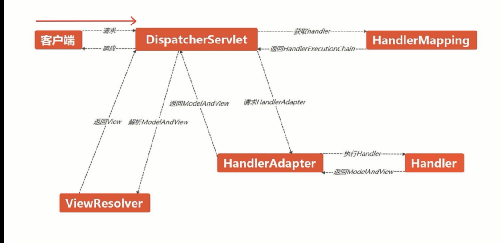

# SpringMVC入门


## 快速入门

#### **MVC设计模式**

- Controller：负责接收并处理请求，响应客户端。
- Model：模型数据，业务逻辑。
- View：呈现模型，与用户进行交互。


#### **SpringMVC**

- 目前最好的实现MVC设计模式的框架。
- 是Spring框架的一个后续产品
- Spring框架的一个子模块，二者可以很好的结合使用，不需要整合。


## 详解

#### 核心组件

1. DispatcherServlet：前置控制器。
2. Handler：处理器，完成具体业务逻辑。
3. HandlerMapping：将请求映射到Handler。
4. HandlerIntercepteor：处理器拦截器。
5. HandlerExecutionChain：处理器执行链。
6. HandlerAdapter：处理器适配器。
7. ModelAndView：装载模型数据和视图信息。
8. ViewResolver：视图解析器。


#### 实现流程

1. 客户端请求被DispatcherServlet接收。
2. DispatcherServlet将请求映射到Handler。
3. 生成Handler以及HandlerInterceptor。
4. 返回HandlerExecutionChain（Handler+HandlerIntercepteor）。
5. DispatcherServlet通过HandlerAdapte执行Handler。
6. 返回一个ModelAndView。
7. DispatcherServlet通过ViewResolver进行解析。
8. 返回填充了模型数据的View，响应给客户端。


#### 流程图




## 深入使用

1. 大部分组件由框架提供，开发者只需通过配置进行关联。
2. 开发者只需手动编写Handler,view


### 基于XML配置的使用

1. SpringMVC基础配置。
2. XML配置Controller,HandlerMapping组件映射。
3. XML配置ViewResolver组件映射。


**注：XML配置方式下，Handler类需要实现Controller接口**


#### 案例

**springmvc.xml:**

```xml
    <!--配置HandlerMapping，将url请求映射到Handler-->
    <bean id="handlerMapping" class="org.springframework.web.servlet.handler.SimpleUrlHandlerMapping">
        <!--配置mapping-->
        <property name="mappings">
            <!--配置请求-->
            <props>
                <!--配置test请求对应的handler-->
                <prop key="/test">testHandler</prop>
            </props>
        </property>
    </bean>

    <!--配置Handler-->
    <bean id="testHandler" class="com.imooc.handler.MyHandler"></bean>

    <!--配置视图解析器-->
    <bean class="org.springframework.web.servlet.view.InternalResourceViewResolver">
        <!--用于逻辑视图，例如如下配置，   "show"  ->  "/show.jsp"  -->
        <!--配置前缀-->
        <property name="prefix" value="/"></property>
        <!--配置后缀-->
        <property name="suffix" value=".jsp"></property>
    </bean>
</beans>
```


**MyHandler.java:**

```java
public class MyHandler implements Controller {

    @Override
    public ModelAndView handleRequest(javax.servlet.http.HttpServletRequest httpServletRequest, javax.servlet.http.HttpServletResponse httpServletResponse) throws Exception {

        // ModelAndView用于装载模型数据和逻辑视图
        ModelAndView modelAndView = new ModelAndView();
        // 添加模型数据
        modelAndView.addObject("name","Tom");
        // 添加逻辑视图
        modelAndView.setViewName("show");

        return modelAndView;
    }
}

```


**web.xml:**

```xml
<web-app>
  <display-name>Archetype Created Web Application</display-name>
  
  <servlet>
    <servlet-name>SpringMVC</servlet-name>
    <servlet-class>org.springframework.web.servlet.DispatcherServlet</servlet-class>
    <!--配置SpringMVC.xml的路径-->
    <init-param>
      <param-name>contextConfigLocation</param-name>
      <param-value>classpath:springmvc.xml</param-value>
    </init-param>
  </servlet>
  <servlet-mapping>
    <servlet-name>SpringMVC</servlet-name>
    <url-pattern>/</url-pattern>
  </servlet-mapping>
</web-app>
```


**输出结果：在 show.jsp 读取Key=name的Value=Tom**


### 基于注解方式的使用

1. SpringMVC基础配置。在springmvc.xml中开启自动扫描。在web中配置springMVC.xml路径与DispatcherServlet。
2. Controller，HandlerMapping通过注解进行映射(@Controller \ @RequestMapping)
3. XML配置ViewResolver组件映射

**注意：注解方式的handler不需要实现Controller接口**


#### 三种传值及视图返回方法

**案例：**

**AnnotaionHandler.java:**

```java
@Controller
public class AnnotationHandler {
    /**
     *  业务方法： 使用ModelAndView完成数据的传递，视图的解析（逻辑视图 -> 物理视图）；
     */
    // 配置url映射
    @RequestMapping("/modelAndViewTest")
    public ModelAndView modelAndViewTest() {
        // 创建ModelAndView对象
        ModelAndView modelAndView = new ModelAndView();
        // 填充模型数据
        modelAndView.addObject("name","Tom");
        // 设置逻辑视图
        modelAndView.setViewName("show");

        return modelAndView;
    }


    /**
     *  业务方法：使用Model传值，返回String进行视图解析；
     *  相当于拆分了ModelAndView，用String作为View；
     * */
    @RequestMapping("/modelTest")
    public String ModelTest(Model model) {
        // 填充模型数据
        model.addAttribute("name","Jerry");
        // 设置逻辑视图
        return "show";
    }

    /**
     *  业务方法：Map传值，String进行视图解析；
     * */
    @RequestMapping("/mapTest")
    public String MapTest(Map<String,String> map) {
        // 填充数据模型
        map.put("name","Cat");
        // 设置逻辑视图
        return "show";
    }
}
```


**Sping.xml:**

```xml

    <!--将AnnotationHandler自动扫描到 IOC容器中-->
    <context:component-scan base-package="com.imooc.handler"/>

    <!--配置视图解析器-->
    <bean class="org.springframework.web.servlet.view.InternalResourceViewResolver">
        <!--用于逻辑视图，例如如下配置，   "show"  ->  "/show.jsp"  -->
        <!--配置前缀-->
        <property name="prefix" value="/"></property>
        <!--配置后缀-->
        <property name="suffix" value=".jsp"></property>
    </bean>

```


**与XML配置方式的web.xml一样，输出效果为value值**


## Handler和Controller的区别

**Handler**

HandlerMapping接口实现从URL映射到请求处理程序bean。 支持映射到bean实例和bean names; 

**Controller**

Base Controller接口，表示接收HttpServletRequest和HttpServletResponse实例的组件，就像HttpServlet一样，但能够参与MVC工作流程。Controllers 可以与Struts Action的概念相媲美。

Controller接口的任何实现都应该是可重用的线程安全类，能够在应用程序的整个生命周期中处理多个HTTP请求。为了能够轻松配置控制器，鼓励Controller实现（通常是）JavaBeans。

Controller接口的任何直接实现都只是处理HttpServletRequests，并且应该返回一个ModelAndView，以便由DispatcherServlet进一步解释。


**两者关系**

一般来说，Controller是Handler，但Handler不一定是Controller。

例如，HttpRequestHandler，WebRequestHandler，MessageHandler都是可以使用DispatcherServlet的处理程序。 （（@）Controller是执行Web请求并返回视图的处理程序。）


简而言之，Handler只是一个术语，它不是一个类或接口。 它可以执行映射。


