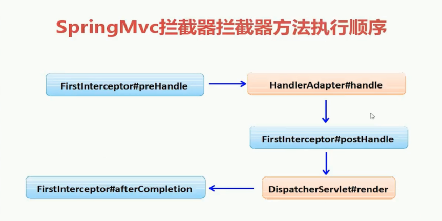

# Spring MVC拦截器

## SpringMVC配置

web.xml中配置核心DispatcherServlet

- 第一种：[servlet-name]-servlet.xml ,比如：springmvc-servlet.xml

- 第二种是：改变命名空间 namespace
  必须配置文件在放入在web-inf目录下。

- 第三种是通过:contextConfigLocation

  - ```xml
    <servlet>
        <servlet-name>springmvc</servlet-name>
        <servlet-class>org.springframework.web.servlet.DispatcherServlet</servlet-class>
        <init-param>
            <param-name>contextConfigLocation</param-name>
            <param-value>classpath*:springmvc.xml</param-value>
        </init-param>
    </servlet>
    <servlet-mapping>
        <servlet-name>springmvc</servlet-name>
        <url-pattern>/</url-pattern>
    </servlet-mapping>
    ```

  - springmvc.xml放在resources目录下即可


**springmvc.xml中：**

```xml
<!-- 映射物理路径 -->
<bean class="org.springframework.web.servlet.view.InternalResourceViewResolver">
    <property name="prefix" value="/WEB-INF/pages/"></property>
    <property name="suffix" value=".jsp"></property>
</bean>

<!-- 映射物理路径 -->
<bean class="org.springframework.web.servlet.view.InternalResourceViewResolver">
    <property name="prefix" value="/WEB-INF/pages/"></property>
    <property name="suffix" value=".jsp"></property>
</bean>
```


## 拦截器和过滤器的区别

- 拦截器是使用JDK动态代理实现的，拦截的是对应调用方法的拦截
- 过滤器是使用filter实现的，拦截的是request对象


## 拦截器配置

### 编写自定义拦截器

Spring MVC也可以使用拦截器对请求进行拦截处理，用户 可以自定义拦截器来实现特定的功能，自定义的拦截器必须实现**HandlerInterceptor接口**：

- **preHandle()**：这个方法在业务处理器处理请求之前被调用，在该方法中对用户请求request进行处理。
  - 如果程序员决定该拦截器对请求进行拦截处理后还要调用其他的拦截器，或者是业务处理器 去进行处理，则返回true；如果程序员决定不需要再调用其他的组件去处理请求，则返回false。(false终止所有请求)
- **postHandle()**：这个方法在**业务处理器处理完请求后**，但是DispatcherServlet向客户端返回响应前被调用，在该方法中对用户请求request进行处理。
- **afterCompletion()**：这个方法在DispatcherServlet完**全处理完请求后**被调用，可以在该方法中进行一些资源清理的操作。


### 拦截器的注册

```xml
<!-- 拦截器的注册 -->
<mvc:interceptors>

    <mvc:interceptor>
        <mvc:mapping path="/user/**"/>
        <bean class="com.imooc.core.LogInterceptor"></bean>
    </mvc:interceptor>

    <mvc:interceptor>
        <!--如果是 /user/* 只能匹配user后一级，而不是若干级 -->
        <mvc:mapping path="/user/**"></mvc:mapping>
        <!--exclude-mapping在所有拦截中进行排除，一般在通配符会有意义。-->
        <mvc:exclude-mapping path="/user/updatepwd"></mvc:exclude-mapping>
        <mvc:exclude-mapping path="/user/updatebackground/*"></mvc:exclude-mapping>
        <bean class="com.imooc.core.LoginInterceptor"></bean>
    </mvc:interceptor>
</mvc:interceptors>
```

**注**

```xml
<!--如果是 /user/* 只能匹配user后一级，而不是若干级 ;
/user/**是若干级
-->
<mvc:mapping path="/user/**"></mvc:mapping>
```


## 拦截器执行顺序

